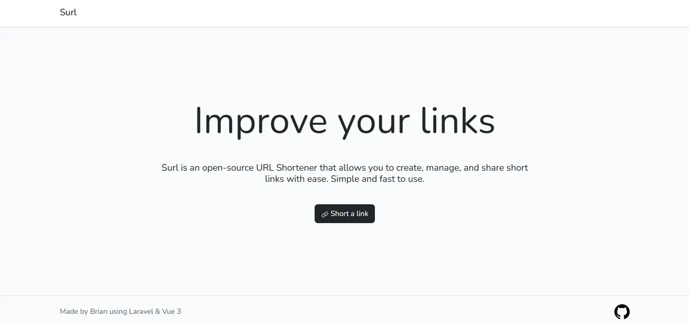

<div align="center">
<a href="https://svgl.app">

</a>
<p></p>
</div>

## Stack

- [**Bootstrap**](https://getbootstrap.com/) - A utility-first CSS framework for rapidly building custom designs
- [**Laravel 11**](https://laravel.com/) - Framework of php for backend
- [**Vue**](https://vuejs.org/) - Framework for views
- [**Laravel-firebase**](https://github.com/kreait/laravel-firebase) - A librarie for use firebase in laravel
- [**Firebase**](https://firebase.google.com/?hl=es-419) -

# Getting Started
## Installation
Please check the official laravel installation guide for server requirements before you start. [Official Documentation](https://laravel.com/docs/11.x/installation)

1. Fork this project:

- [Click here](https://github.com/pardo-salas/urlShortener/fork).

2. Clone the repository:

```bash
git clone git@github.com:YOU_USER/urlShortener.git
```

3. Install dependencies:

```bash
# Install :
npm install
composer install
```
4. Copy the example env file and make the required configuration changes in the .env file
```bash
    cp .env.example .env
```

5. Generate a new application key
```bash
    php artisan key:generate
```

6. Run
```bash
    npm run dev
    php artisan serve
```
